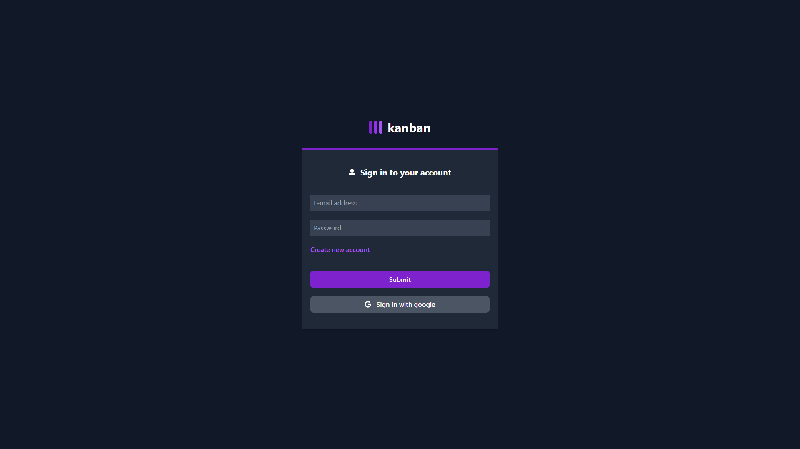
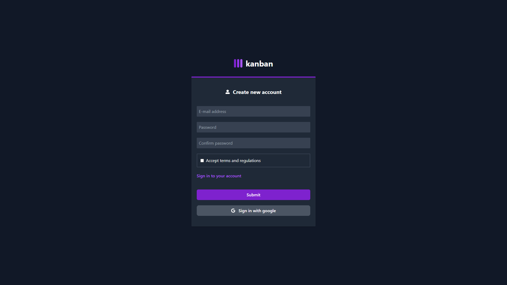
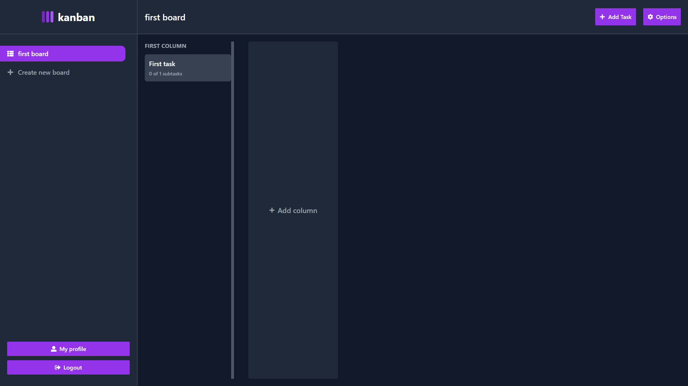
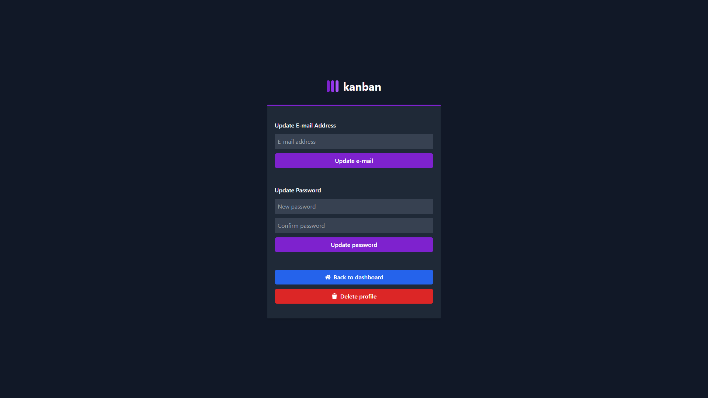

# Kanban Board

Kanban Board is management tool designed to help visualize work. Users can create custom boards and manage tasks in individual columns. Every board, column or task can be modified and deleted. It's fully functional app with nice looking responsive UI.

# Screenshots preview

 

 

 

# Tech stack
+ React
+ React Router Dom
+ Typescript
+ TailwindCSS
+ Redux Toolkit
+ Firebase

# What I've learned ?

In this project I learned more about usage of custom hooks and how useful it can be. I learned how to make good files structure in larger project. 

# Live Preview
You can checkout this app here: https://kanban-board-7be56d.netlify.app
